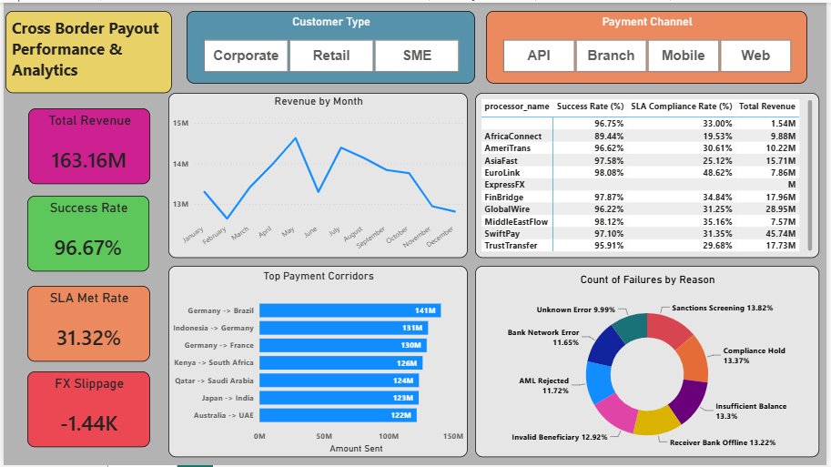

# 🌍 Cross-Border Payout Performance & Analytics

An end-to-end Data Analytics project analyzing cross-border remittance transactions, vendor SLA compliance, foreign exchange (FX) slippage, and operational risk factors.

This project demonstrates the complete data pipeline: Exploratory Data Analysis (EDA) & Data Cleaning in Python, Relational Modeling & Advanced Analytics in SQL, and an Executive Single-Page Dashboard in Power BI.

---

## 📌 Business Overview & Problem Statement

Fintech remittance platforms process billions of dollars across global corridors. To ensure profitability and customer satisfaction, operations teams need to address key challenges:

- **Operational Bottlenecks & Failure Root Causes:** Identifying why payment transfers fail (e.g., Sanctions, Compliance Holds, Offline Bank Networks).

- **Vendor SLA Compliance:** Evaluating payment processors (vendors) based on success rates and processing speeds.

- **FX Slippage Risk:** Quantifying foreign exchange rate variance between payment initiation and settlement.

- **Corridor Performance:** Identifying high-volume remittance trade routes and customer segment trends.

---

## 📊 Dashboard Preview



---

## 💡 Key Business Insights

- **Transaction Volume & Revenue:** The platform processed **$30.09 Billion** in total volume, generating **$163.16 Million** in gross payout fee revenue.

- **Success Rate:** Achieved an overall operational transfer success rate of **96.67%**.

- **SLA Performance Gap:** Only **31.32%** of transfers met strict target SLA timelines, highlighting a key operational bottleneck with vendor processing speed.

- **Controlled FX Slippage:** Net FX slippage loss was tightly controlled at **-$1.44K**, demonstrating strong currency hedging and quick settlement windows.

- **Top Corridors:** **Germany → Brazil** and **Indonesia → Germany** represent the highest volume payout corridors.

- **Failure Diagnostics:** **Sanctions Screening (13.82%)** and **Compliance Holds (13.37%)** represent the top two drivers of failed transactions.
```
